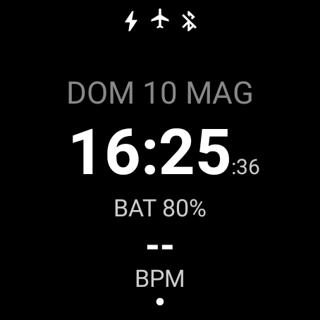

# e4heart (Native Wear OS)

**Italiano 🇮🇹** | [English 🇺🇸](./README.md)

<p align="center">
  
</p>

Applicazione nativa per Wear OS sviluppata in Kotlin e Jetpack Compose per il monitoraggio della frequenza cardiaca in tempo reale, ottimizzata per il **pacing del PEM** (Post-Exertional Malaise).

## Descrizione e finalità
L'app è progettata specificamente per supportare persone affette da **ME/CFS** e **Long COVID** nella gestione della propria energia attraverso il monitoraggio del battito cardiaco. L'obiettivo è prevenire il superamento della soglia anaerobica ventilatoria (V/AT), riducendo così il rischio di ricadute (crash) dovute allo sforzo.

## Logica di monitoraggio e basi scientifiche
La logica dell'app si basa sulle linee guida della **Workwell Foundation** per il pacing cardiaco:

1.  **Calcolo della soglia (Alert)**: La soglia di allerta è impostata a **RHR + 15 BPM** (Resting Heart Rate + 15). Questo valore è un'approssimazione prudente della soglia anaerobica per chi soffre di patologie legate al PEM.
2.  **Regola dei due minuti**: Seguendo le indicazioni scientifiche ("Avoid spending time above the V/AT for more than two minutes"), l'app attiva la vibrazione solo se il battito rimane sopra la soglia in modo continuativo per almeno 120 secondi. Questo evita falsi positivi dovuti a brevi picchi (spike) momentanei.
3.  **Soglia di recupero (Recovery)**: Seguendo le raccomandazioni della fondazione, l'allerta cessa solo quando il battito scende entro 10 BPM dalla frequenza a riposo (**RHR + 10 BPM**). Questo assicura che il corpo abbia recuperato sufficientemente prima di riprendere l'attività.

**Fonte**: [Workwell Foundation - Pacing with a heart rate monitor](https://workwellfoundation.org/pacing-with-a-heart-rate-monitor-to-minimize-post-exertional-malaise-pem-in-me-cfs-and-long-covid/)

## Funzionalità
- Monitoraggio continuo del battito cardiaco.
- Interfaccia ottimizzata per schermi circolari.
- **Internazionalizzazione**: Supporto completo per italiano e inglese.
- Slider di precisione (step di 1 BPM) per impostare il proprio battito a riposo (RHR).
- Avvisi via vibrazione: allarme iniziale discreto e promemoria insistenti se il battito non scende.
- **Ambient mode**: Ottimizzazione della luminosità notturna per visibilità continua senza bagliore.
- **Efficienza Energetica**: Logica di aggiornamento intelligente in background per Tile e Complication per preservare la batteria.
- **UI Reattiva**: Architettura `StateFlow` per una fluidità superiore e minor consumo in primo piano.

## Guida allo sviluppo e compilazione
Il progetto è un'applicazione Android nativa basata su Gradle. Puoi compilarla utilizzando i comandi semplificati del `Makefile` o direttamente tramite Gradle.

### Prerequisiti
- **Java Development Kit (JDK)**: Versione 17 o superiore.
- **Android SDK**: API 34 (Android 14) installata.
- **ADB (Android Debug Bridge)**: Necessario per l'installazione e il debug sull'orologio.
- **Android Studio (opzionale)**: Consigliato per lo sviluppo e l'anteprima dell'interfaccia.

### Compilazione e installazione
Apri il terminale nella cartella del progetto e usa i seguenti comandi:

1.  **Compilazione (Generazione APK)**:
    ```bash
    make build
    ```
    (Oppure `./gradlew assembleDebug`)

2.  **Installazione ed esecuzione**:
    Assicurati che l'orologio sia connesso via ADB (Wi-Fi o Bluetooth Debugging) e digita:
    ```bash
    make run
    ```
    (Questo comando installa l'APK e avvia l'attività principale sul dispositivo).

3.  **Monitoraggio dei log**:
    Per visualizzare i messaggi di sistema dell'app (filtrati per `e4heart`):
    ```bash
    make log
    ```

4.  **Pulizia**:
    Se riscontri problemi di build, pulisci i file temporanei:
    ```bash
    make clean
    ```

## Requisiti hardware
- Qualsiasi orologio Wear OS con sensore cardiaco.
- Android 9.0 (API 28) o superiore.

## ⚠️ Disclaimer medico
Questa applicazione **non è un dispositivo medico**. I dati forniti sono solo a scopo informativo e di supporto al monitoraggio personale (es. PEM pacing). L'app non deve essere utilizzata per diagnosticare, trattare o prevenire alcuna patologia. Consulta sempre un medico professionista per decisioni riguardanti la tua salute.

## Licenza
Distribuito sotto licenza **GNU GPLv3**. Vedi il file `LICENSE` per i dettagli.

## Note sullo sviluppo
Questo progetto è assistito da **Gemini CLI**, che ha curato l'implementazione dell'internazionalizzazione, l'ottimizzazione della logica di pacing basata su fonti scientifiche e l'aggiornamento della documentazione.
